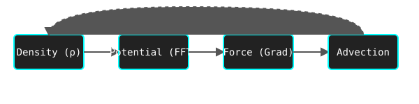

<p align="center">
  
</p>

# Multi-State Smooth Particle Life (CuPy Optimized)

A high-performance implementation of Smooth Life with multiple interacting states, accelerated by CUDA via CuPy. This version is optimized for numerical stability, high precision (`float64`), and modularity.

<p align="center">
  
</p>

## Precision and Stability
This project has been optimized for numerical stability and math precision:
- **High Precision**: Built natively with `float64` support to minimize floating-point drift.
- **Stable Activations**: Sigmoids and state transition functions are clamped and protected with modern stability safeguards (epsilons, clipping).
- **Mass Conservation**: Employs a normalization step to ensure total density remains constant across simulation steps.
- **Isotropic Laplacian**: Uses a 9-point stencil for more natural diffusion.

## Project Structure
The code is organized into modular components for better maintainability:
- `main.py`: Entry point and application loop.
- `src/engine.py`: Core simulation logic and state management.
- `src/math_utils.py`: CUDA-accelerated math kernels.
- `src/configs.py`: Hyperparameters and global settings.
- `src/visualization.py`: Pygame rendering and input handling.

## Setup

1. **Automated Setup**:
   Simply run the setup script:
   ```bash
   chmod +x setup.sh
   ./setup.sh
   ```

2. **Manual Installation**:
   ```bash
   python3 -m venv venv
   source venv/bin/activate
   pip install -r requirements.txt
   ```

## Usage
Activate the environment and run the main script:
```bash
source venv/bin/activate
python main.py
```

### Controls
- `R`: Randomize interaction matrices.
- `B`: Reset the board with random densities.
- `C`: Clear the board.
- `UP/DOWN`: Increase/Decrease time step (`dt`).
- `LEFT/RIGHT`: Increase/Decrease `viscosity`.
- `+/-`: Increase/Decrease `frame_skip`.
- `SHIFT`: Fine-tune parameter changes.
- `Mouse Click`: Draw density on the board.

## Testing
To run the automated conservation and precision tests:
```bash
export PYTHONPATH=.
python tests/test_conservation.py
```
